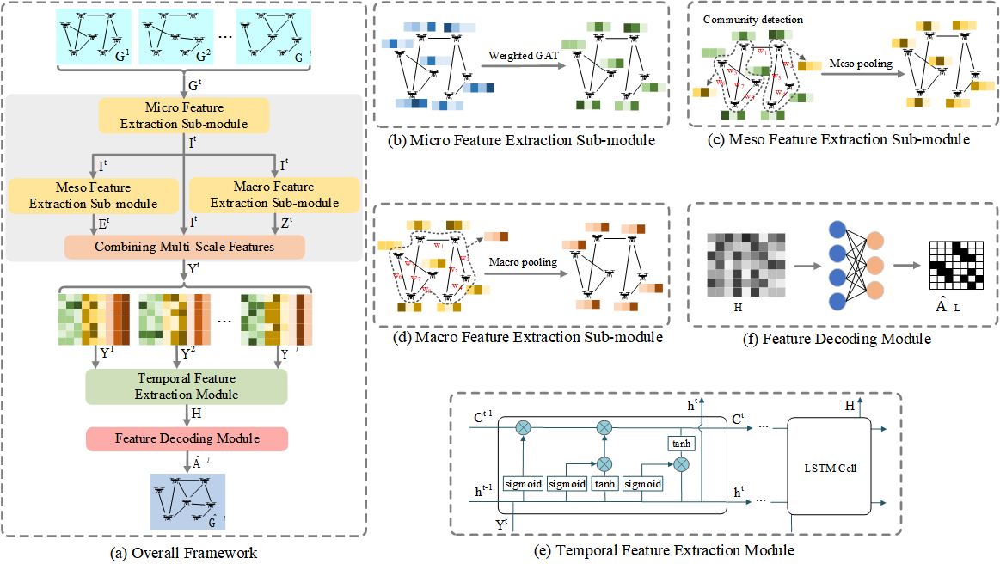

# MUST: Multi-Scale Structural-Temporal Link Prediction Model for UAV Ad Hoc Networks

### Abstract
Predicting future connections among Unmanned Aerial Vehicles (UAVs) is one of the fundamental tasks in UAV Ad Hoc Networks (UANETs). In adversarial environments where UAV operational information is unavailable, future link prediction must rely solely on the observed historical topological data. However, the highly dynamic and sparse nature of UANET topologies poses substantial challenges in capturing structural and temporal link formation patterns. Most existing link prediction methods focus only on single-scale structural features while neglecting the effects of network sparsity, thus limiting their performance when applied to UANETs. In this paper, we propose MUST, a Multi-scale Structural-Temporal link prediction model for UANETs. In our model, multi-scale structural representations are learned using a weighted graph attention network combined with multi-scale pooling, capturing features at the levels of individual UAVs, UAV communities, and the entire network, which are then fused via concatenation. Then, a stacked long short-term memory network is employed to learn the temporal dynamics of these multi-scale structural features. To address the impact of network sparsity, we develop a tailored loss function that emphasizes the contribution of existing links during training. We validate the performance of MUST using several UANET datasets generated through simulations. Extensive experimental results demonstrate that MUST achieves state-of-the-art link prediction performance in highly dynamic and sparse UANETs.

### Requirements

- **Python**: 3.8.20
- **PyTorch**: 1.12.1
- **DGL**: 1.1.2
- **PyG**: 2.3.1
- **Scikit-learn**: 1.3.0
